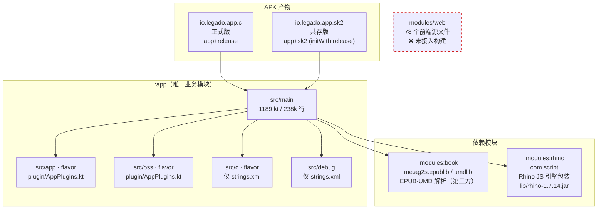
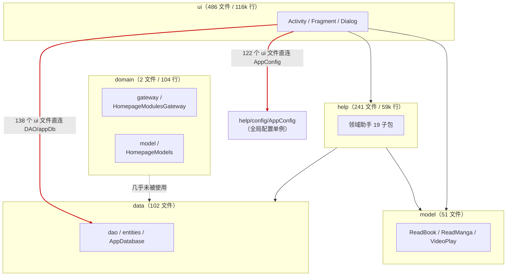
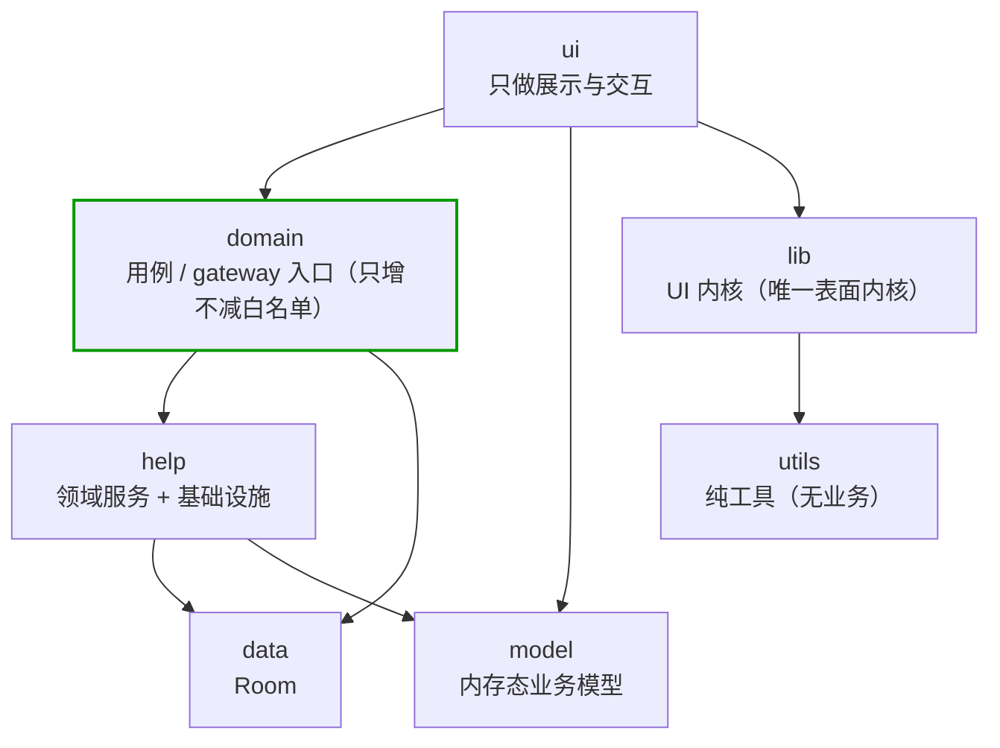
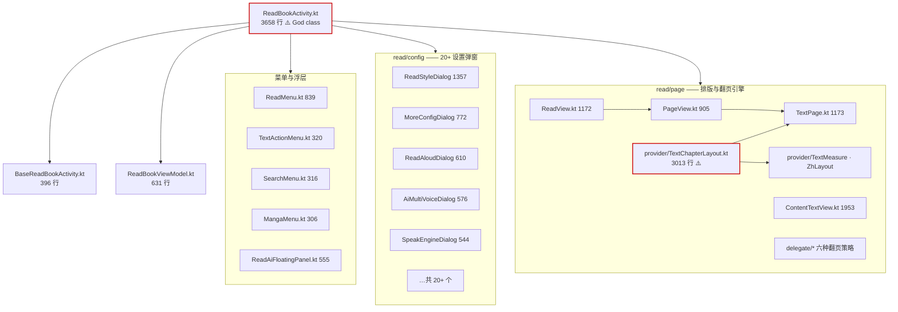

# legado-sk 架构梳理

> 本文是**当前代码事实**的描述，不是设计理想。所有数字由 `docs/架构.md` 同目录的统计口径实测得出（见 §7「数据口径」），改动代码后需重新核对。
> 红线（R8 禁用、进度同步三禁、朗读架构唯一形态、DB 迁移线、内置书源已移除等）以 `AGENTS.md` §4 与 `companion/发布版更新记录.md` 为准，本文不复制其内容，只索引。

---

## 1. 一屏全貌

| 维度 | 实测值 |
|---|---|
| 工程模块 | `:app`、`:modules:book`、`:modules:rhino`（`settings.gradle` 仅 include 这三个） |
| Kotlin 文件 | **1189** 个（`app/src/main`） |
| Kotlin 行数 | **238,120** 行 |
| Java 文件 | **10** 个 / 2,995 行（8 个在 `lib/icu4j`，另有 `QueryTTF.java`、`FilePickerIcon.java`） |
| 单一模块 | 全部业务代码在 `:app`，无 feature 模块化 |
| flavor / buildType | `app`+`release` = `io.legado.app.c`（正式版）；`app`+`sk2` = `io.legado.app.sk2`（共存版） |
| 源码集 | `main`、`app`（flavor）、`oss`（flavor）、`c`（flavor）、`debug`、`test`、`androidTest` |
| 布局文件 | 319 个（经 **ViewBinding** 引用，251 个文件使用） |
| 测试 | 31 个测试文件 |
| UI 框架 | 传统 View 体系（非 Compose）+ ViewBinding + 自研玻璃表面内核 |

**结论**：这是一个**单模块、传统 View、重反射**的 Android 应用。规模已到「必须靠纪律维持」的量级，但**分层在内核层是清晰的**，问题集中在业务层的边界穿透（见 §4）。

---

## 2. 模块与产物图



**要点**：
- `:modules:book` 与 `:modules:rhino` 是**真实依赖**（`app/build.gradle` 有 `implementation(project(...))`），包名属第三方（`me.ag2s.*` / `com.script.*`），**不应混入 SK 的包命名规范**。
- `src/app` 与 `src/oss` 各有一个 `plugin/AppPlugins.kt`，是 flavor 级替换点。
- ⚠️ `modules/web`（78 文件）**是孤立物**：不在 `settings.gradle`、无任何构建引用（详见瘦身清单）。

---

## 3. 包职责与规模表

| 包 | 文件 | 行数 | 职责 | 健康度 |
|---|---:|---:|---|---|
| `ui` | 486 | 116,267 | 所有界面（Activity/Fragment/Dialog/View） | ⚠️ 过重，混入业务逻辑 |
| `help` | 241 | 58,831 | 领域助手（19 子包：ai/tts/config/review/book/cache/agent/storage/http…） | 尚可，根层平铺 |
| `model` | 51 | 20,181 | 内存态业务模型（ReadBook/ReadManga/VideoPlay/CacheBook…） | 尚可 |
| `utils` | 110 | 12,376 | 工具与扩展函数 | ⚠️ 杂物间，根下 89 个平铺文件 |
| `lib` | 106 kt + 8 java | 8,950 kt / 2,700 java | **UI 内核与基础设施**（theme/prefs/dialogs/permission/webdav/cronet/mobi/icu4j） | ✅ 健康 |
| `service` | 19 | 8,731 | 前台/后台 Service（朗读、导出、缓存、下载、TTS） | ⚠️ 两个超大文件 |
| `data` | 102 | 7,192 | Room 数据库（dao 36 / entities 61 / repository 1） | ✅ 健康 |
| `base` | 20 | 1,854 | 基类（BaseActivity/BaseFragment/BaseDialog…） | ✅ 健康 |
| `constant` | 15 | 1,285 | 常量与枚举 | ✅ 健康 |
| `api` | 8 | 866 | 对外接口（Web 控制、快捷方式） | 尚可 |
| `receiver` | 7 | 531 | 广播接收器 | 尚可 |
| `web` | 6 | 457 | 内置 HTTP / WebSocket 服务 | 尚可 |
| `plugin` | 6 | 195 | 插件 SPI（朗读引擎等） | ✅ 健康 |
| `domain` | **2** | **104** | 名义上的领域层 | ❌ **空壳** |
| `exception` | 8 | 42 | 异常类型 | ✅ 健康 |

### 3.1 `lib` —— 唯一的内核层（健康，应作为新代码范本）

| 子包 | 文件 | 行数 | 职责 |
|---|---:|---:|---|
| `theme` | 21 | 2,551 | `ThemeStore` / `SurfaceStyle` / `SurfaceDrawable` / 玻璃表面内核 |
| `prefs` | 15 | 1,484 | 偏好设置控件 |
| `mobi` | 34 | 1,418 | MOBI 解析（第三方移植） |
| `cronet` | 11 | 1,301 | Cronet 网络拦截 |
| `dialogs` | 9 | 828 | `AndroidAlertBuilder` 等统一弹窗构造 |
| `permission` | 12 | 781 | 权限请求 |
| `webdav` | 4 | 587 | WebDAV 客户端 |
| `icu4j` | 8 (.java) | 2,700 | ICU4J 字符集检测（`CharsetDetector` 等，被 `utils/EncodingDetect.kt` / `LibArchiveUtils.kt` 使用） |

### 3.2 `data` —— 数据层（健康）

| 子包 | 文件 | 行数 | 职责 |
|---|---:|---:|---|
| `entities` | 61 | 3,591 | Room 实体 |
| `dao` | 36 | 2,037 | Room DAO |
| `agent` | 2 | 173 | Agent 相关 |
| `repository` | **1** | **127** | ❌ 仅一个文件，仓储层未真正建立 |
| 根 | 2 | 1,264 | `AppDatabase.kt`(312) / `DatabaseMigrations.kt`(952) |

---

## 4. 分层依赖图

### 4.1 现状（含被穿透的边）



**实测证据**：
- 486 个 `ui` 文件中，**138 个**直接引用 `bookDao` / `appDb` / `*Dao`；
- **122 个**直接引用 `AppConfig.`；
- `domain` 仅 2 个文件，且 `gateway` 只有 `HomepageModulesGateway` 一个入口 —— **分层在名义上存在，实际被穿透**。

### 4.2 目标（依存量逐步收敛，非一次性大迁移）



**收敛策略**：不强制改写存量 138+122 处（会产生失控大 diff），改为
1. `domain/` 只服务**新增**能力；
2. 建立**只减不增的白名单**（当前允许直连 DAO/AppConfig 的文件），并由守卫测试锁定；
3. 新增代码若需直连 DAO/`AppConfig`，必须在提交说明中写明理由。

---

## 5. 阅读页子系统图（最复杂子系统）

`ui/book` 占 55,771 行 / 206 文件，其中 `ui/book/read` 一个目录就 **30,159 行 / 84 文件**。



**翻页策略**（`read/page/delegate/`，六种并存，通过 `PageDelegate` 接口多态）：
`SimulationPageDelegate`(545) / `ScrollPageDelegate`(166) / `HorizontalPageDelegate`(146) /
`CoverPageDelegate`(102) / `LinkedCoverPageDelegate`(131) / `SlidePageDelegate`(57) / `NoAnimPageDelegate`(20)。

**超 1000 行文件清单（全库 25 个，Top 10）**：

| 行数 | 文件 |
|---:|---|
| 3658 | `ui/book/read/ReadBookActivity.kt` |
| 3013 | `ui/book/read/page/provider/TextChapterLayout.kt` |
| 2583 | `model/localBook/EpubFile.kt` |
| 2212 | `model/localBook/EpubLayoutEngine.kt` |
| 2201 | `service/ExportBookService.kt` |
| 2072 | `help/review/ReviewSnapshotCapture.kt` |
| 2038 | `ui/main/explore/ExploreFragment.kt` |
| 1961 | `ui/main/MainActivity.kt` |
| 1953 | `ui/book/read/page/ContentTextView.kt` |
| 1898 | `service/BaseReadAloudService.kt` |

⚠️ **朗读子系统红线**：`service/BaseReadAloudService.kt`、`TTSReadAloudService.kt`、`HttpReadAloudService.kt` 属 10023 确立的朗读架构（「两原语 + 纯函数跟随规则 + 派生脱节」），**改动前必读 `docs/朗读链路.md`**，不得回退到旧的 detach/跟随地板方案。

---

## 6. 「新增代码放哪」决策表

| 我要加的东西 | 放哪 | 依据 |
|---|---|---|
| 新界面（Activity/Fragment） | `ui/<域>/` | 按业务域归包 |
| 新弹窗（模态） | `ui/<域>/`，继承 `BaseDialogFragment` | `AGENTS.md` §4 UI 内核 |
| 新底部 Sheet | 同上，继承 `BaseBottomSheetDialogFragment` | 同上 |
| 新简单确认/选择框 | 调 `alert`/`selector`/`AndroidAlertBuilder` | 同上 |
| 新右上角菜单 | `SurfacePopupMenu` / `View.showPopupMenu` | 同上 |
| 阅读页同窗口浮层 | 复用 `SurfaceBackdrop`，先声明宿主背景层 | 同上 |
| 新业务规则 / 跨 UI 复用的用例 | **`domain/`**（新增 gateway/usecase） | 本文 §4.2 |
| 新领域助手（备份、导出、缓存…） | `help/<域>/` | 现有 19 子包 |
| 新工具 / 扩展函数 | `utils/ext/`（扩展）或 `utils/` 具体工具类 | 本文 §7 |
| 新 UI 内核能力（主题/表面/弹窗基类） | `lib/theme`、`lib/dialogs` | 内核层唯一 |
| 新 Room 实体 / DAO | `data/entities`、`data/dao` | — |
| 新后台任务 | `service/` | — |
| 新对外接口 | `api/` | — |

**判定规则（按序）**：
1. 是「界面」→ `ui`；是「内核/基础设施」→ `lib`；是「数据」→ `data`；
2. 都不像 → 优先放 `help/<域>/`，**不要新建顶层包**；
3. 只有「跨多个 UI 复用且含业务判断」才考虑 `domain/`；
4. **禁止**：新建 `xxxBlur`/`xxxGlass`/`xxxPopup` 私有表面实现（§4 绝对禁止）；新建顶层包前先证明现有 15 个顶层包无法表达。

---

## 7. 数据口径（复现方式）

本文所有数字的统计口径：

```powershell
$root = 'app\src\main\java\io\legado\app'
# 文件数 / 行数
$all = Get-ChildItem $root -Recurse -Filter *.kt -File
$all.Count
($all | Get-Content | Measure-Object -Line).Lines
# 单包
Get-ChildItem "$root\ui" -Recurse -Filter *.kt -File | ForEach-Object { ... }
# 穿透统计
(Get-ChildItem "$root\ui" -Recurse -Filter *.kt -File | Select-String -Pattern '\b(bookDao|bookChapterDao|appDb|BookSourceDao|rssSourceDao)\b' -List).Count
(Get-ChildItem "$root\ui" -Recurse -Filter *.kt -File | Select-String -Pattern '\bAppConfig\.' -List).Count
```

**实测快照（2026-10-04，commit `2667368b`）**：1189 kt / 238,120 行 / 319 layout / 31 test / 251 文件用 ViewBinding。

> ⚠️ 文档与代码漂移的判定：**以源码为准**（`AGENTS.md` §0.8 同款规则）。改动包结构后请重跑本节口径并更新 §1、§3。

---

## 8. 明确不做的事（避免后人重复提议）

| 提议 | 结论 | 理由 |
|---|---|---|
| 拆成 `:feature:*` 多模块 | ❌ 不做 | 25 万行确实重，但本项目**重反射**（书源引擎/JS 桥/动态类加载），拆模块会显著增加 R8/反射/资源体系与构建风险，收益远低于风险 |
| 全量迁移 `utils`/`help` 包路径 | ❌ 不做 | 牵动上千处 import，产生巨量零收益 diff，违背「最小完整改动」 |
| 重写为 Compose | ❌ 不做 | 与自研玻璃表面内核（§4）深度耦合，重写即推翻内核 |
| 拆分 `TextChapterLayout.kt`（3013 行） | ⚠️ 暂不做 | 排版引擎高热高风险，收益/风险比差 |
| 启用 R8 / 混淆 | ❌ **红线** | 见 `AGENTS.md` §4 功能红线 |

---

## 9. 待办与已知问题（本文只登记，不修）

1. **`domain/` 空壳**：`data/repository` 也仅 1 文件 127 行 —— 分层纪律缺失（见 §4.2 收敛策略）。
2. **God class**：`ReadBookActivity.kt` 3658 行（见 §5）。
3. **`utils` 根下 89 个平铺文件**混装四类关注点：纯扩展、具体工具、**UI 表面内核**（`SurfaceBackdrop.kt` 852 行，本应属 `lib/theme/surface`）、业务路由（`BookReadingActivityRouter.kt`）。
4. **`help` 根下 30 个平铺文件**：`JsExtensions.kt`(1124)、`AppWebDav.kt`(490)、`DefaultData.kt`(348) 等与 19 个子包混层。
5. **测试覆盖极不均衡**：31 个测试文件里 `help/storage` 占 6 个（备份恢复是历史重灾区，投入合理）；而 3658 行的 `ReadBookActivity` 仅有 1 个菜单常量级测试（`CloudProgressMenuGuardTest`），`ui` 全层测试近乎为零。
6. ~~**`lib/aliyun`（5 行）为死料**~~ ✅ **已于本次架构梳理删除**（连同 `ALiYun.kt`，零调用点）。
7. ⚠️ **`lib/icu4j`（8 个 `.java` / 2,700 行）曾被误判为空目录** —— 实为 ICU4J 字符集检测，被 `utils/EncodingDetect.kt` 与 `utils/compress/LibArchiveUtils.kt` **真实使用，不可删**。教训：「按包名 grep」会漏掉 `import io.legado.app.lib.icu4j.CharsetDetector` 这类**跨包名引用**，判死必须查具体符号名（`CharsetDetector`），不能只 grep 目录名。

> 逐项证据、影响与验证方式见 `docs/架构瘦身清单.md`。
